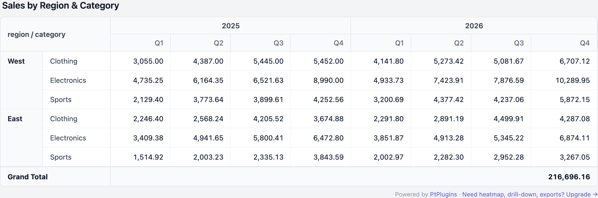

# Filament Pivot Table — Free

<p align="center">
  
</p>

> Free Blade component that renders Eloquent records as a pivot table with Sum aggregation. Works with **Filament 3, 4, and 5**.

**Live demo:** [ptplugins.com/demo/pivot-pro](https://ptplugins.com/demo/pivot-pro) — no signup required. The demo shows the **Pro** version with all features; the Free component renders the same table style limited to 2×2 dimensions and Sum aggregation.

```blade
<x-pivot-free::pivot-table
    :records="$sales"
    rowField="region"
    columnField="month"
    valueField="amount"
/>
```

That's it. One line in your view — pivot on screen.

---

## Installation

```bash
composer require ptplugins/filament-pivot-table-free
```

No publishing, no migrations, no config. The component auto-registers as `<x-pivot-free::pivot-table />`.

## Examples

### 1. Single dimension (1 row × 1 column)

```php
// In your Filament Resource page or any Blade view:
$sales = Sale::query()->whereYear('created_at', 2026)->get();
```

```blade
<x-pivot-free::pivot-table
    :records="$sales"
    rowField="region"
    columnField="month"
    valueField="amount"
    title="Sales by Region & Month"
/>
```

### 2. Two dimensions (2 row × 2 column)

```blade
<x-pivot-free::pivot-table
    :records="$sales"
    :rowFields="['region', 'category']"
    :columnFields="['year', 'quarter']"
    valueField="amount"
/>
```

The leftmost dimensions are rendered as grouping headers (`rowspan` / `colspan`).

### 3. Eloquent query (lazy)

If you'd rather pass a query, the component runs `->get()` for you:

```blade
<x-pivot-free::pivot-table
    :query="App\Models\Sale::query()->whereYear('created_at', 2026)"
    rowField="region"
    columnField="month"
    valueField="amount"
/>
```

## What's included (Free)

- Up to **2 row × 2 column** dimensions
- **Sum** aggregation
- Grand Total
- **Light + dark theme** out of the box (Tailwind `dark:` variants)
- **Translations** — English bundled, publish & override for any locale
- Eloquent query OR Collection / array of records
- Filament v3 + v4 + v5 compatible (single codebase)

### Requirements

- Laravel 10+ / 11+ / 12+
- PHP 8.2+
- **Tailwind CSS in your build** — every Filament project already has it. The component uses standard utility classes (`bg-white`, `dark:bg-gray-900`, `text-gray-900`, etc.) that ship with the default Tailwind preset.

### Translations

```bash
# Publish English (and any other locales you add later)
php artisan vendor:publish --tag=pivot-free-translations
```

Edit / add at `lang/vendor/pivot-free/{locale}/messages.php`.

## What's NOT included — that's where Pro comes in

| Feature | Free | Pro |
|---|---|---|
| Row × column dimensions | up to 2 × 2 | unlimited (multi-level) |
| Aggregations | Sum | Sum, Avg, Count, Min, Max, % |
| Drill-down (expand / collapse) | — | ✅ |
| Heatmap (color gradients) | — | ✅ |
| Trend indicators (▲ / ▼ %) | — | ✅ |
| CSV / Excel export | — | ✅ |
| Configurable UI (Rows / Cols / Values pickers) | — | ✅ |
| Saved filter sets / configurations | — | ✅ |
| URL deep linking | — | ✅ |
| Filament Resource Page integration | — | ✅ |
| Priority email support + 1-year updates | — | ✅ |

→ **[Upgrade to Pro at ptplugins.com](https://ptplugins.com/filament-pivot-table)** — Solo $70 / Unlimited $210

## License

MIT. Made with ❤️ by [Premtech agency](https://agency.premte.ch).
